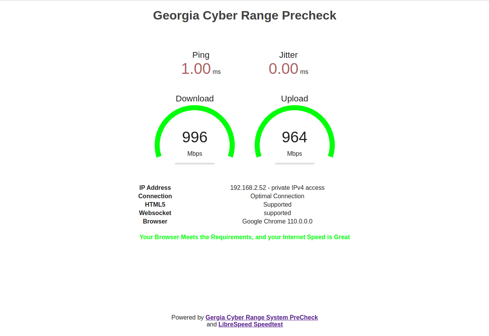

= System PreCheck

This project was built to file the need of being able to provide a simple
systems requirement check for remote based training. Leveraging already
existing Opensource technologies, we have added a few extra customization
to enhance those capabilities.

== Technologies
This project implements use of LibreSpeed's Speedtest project to allow for
a lightweight speedtest to be performed. This project can be found at: +

https://github.com/librespeed/speedtest

This project also implements use of jmalloc's HTML5 WebSocket Echo project
to allow for a lightweight WebSocket test to be performed. This project can
be found at: +

https://github.com/jmalloc/echo-server

== Features
The System PreCheck project provides the following overall features:

- HTML5 Browser Detection
- WebSocket Functionality Check (port 8080)
- TCP Port Checks (80) _Does not include a SSL Proxy_
- Speedtest (LibreSpeed)

The overall goal of this project is to provide a docker implementation providing an all-in-one solution for a system prechecks for remote based training that leverages Apache Guacamole for remote access.

== Installation
The `Dockerfile` is provided to build the image for PreCheck with LibreSpeed **(_Ensure to leverage your own_ `favicon.ico`)**. The `docker-compose.yml` file is provided to run the docker environment wtih two services overall:

- **PreCheck w/ LibreSpeed Container**
- **Echo WebSocket Container**

The overall design is for standalone use only, and the build steps below are
to address building an image with multiple contexts.

. Install Required Packages
[source,shell]
----
sudo apt update && sudo apt install docker.io docker-compose containerd
----

. Clone the repository
[source,shell]
----
git clone https://gitlab.com/gacybercenter/open/precheck.git
cd precheck && git submodule update --init --recursive
----

. Build the Image
[source,shell]
----
docker-compose build
----

. Run the Services
[source,shell]
----
docker-compose up -d
----

== Notice
This project is not affiliated with LibreSpeed or the LibreSpeed Speedtest project. This project is a derivative work of the LibreSpeed Speedtest project to enable additional checks and is not meant as a replacement for the original project.

This project is not affiliated with jmalloc or the HTML5 WebSocket Echo project. This project leverages the HTML5 WebSocket Echo project AS-IS.

== License
Copyright 2023 Augusta University

Licensed under the Apache License, Version 2.0 (the "License");
you may not use this file except in compliance with the License.
You may obtain a copy of the License at

   http://www.apache.org/licenses/LICENSE-2.0

Unless required by applicable law or agreed to in writing, software
distributed under the License is distributed on an "AS IS" BASIS,
WITHOUT WARRANTIES OR CONDITIONS OF ANY KIND, either express or implied.
See the License for the specific language governing permissions and
limitations under the License.

